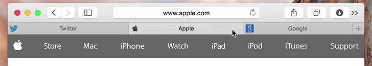

SafariHack
==========

A simple extension for Safari.app which adds a favicon on each tab.
Only support latest Safari.app on OS X 10.10 Yosemite.

Usage
-----

This extension works as a [SIMBL](http://www.culater.net/software/SIMBL/SIMBL.php) plugin, you need to install SIMBL or compatible application, like [EasySIMBL](https://github.com/norio-nomura/EasySIMBL).

Build using Xcode 6.1, which will place `SafariHack.bundle` in `~/Library/Application Support/SIMBL/Plugins`.

Restart Safari.app then you'll see a favicon on each tab.